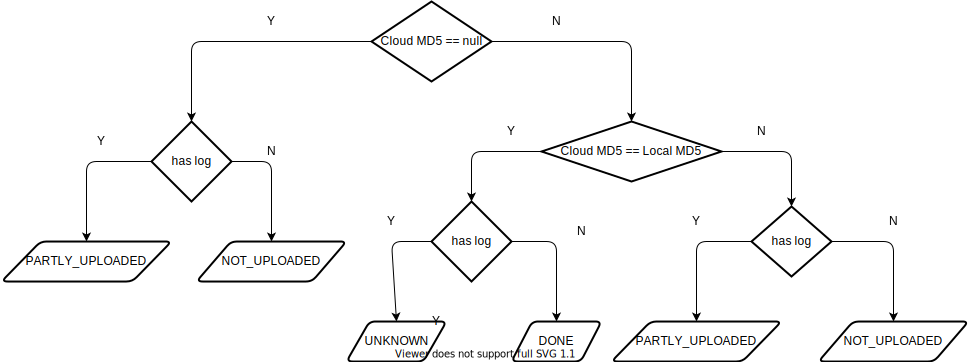

# 类的设计
## 概况
代码的类结构如下：
1. `AWSS3Service`: 实现与 AWS S3 服务器交互的类
2. `ChunkFileLog`：一个文件日志类，用于记录文件上传的情况
3. `Config`：配置程序的变量，用于其他类的共享
4. `FileListener`: 实现文件变更（创建、修改、删除）的监听的类
5. `MD5Utils`：计算整个文件的MD5、以及分块上传的文件的MD5
1. `S3Sync`: 程序的入口类

## 类图

# 文件状态
## 分类
- `NOT_UPLOADED`：文件还没被上传
- `NOT_UPDATED`：服务器有相应的文件，但是本地文件比较新，服务器文件需要被更新
- `PARTLY_UPLOADED`：文件上传到一半
- `DONE`：文件已经被上传到服务器
- `UNKNOWN`：未知情况

## 具体实现
注：文件若存在日志则表明改文件可能上传到一半

# 分块的MD5
AWS ETag 对于分块上传的文件是这样计算的：按顺序用二进制的形式连接各个块的效检和，然后再对链接后的效检和进行MD5运算获得摘要`s`，最后形成`s-n`，n 为块的个数

具体实现见`MD5Utils.java`的`public static String getS3MD5(byte[] input)`
