# 类的设计
在本次实验中，我们遵守了`MVC`的设计里面，将代码分成了`model`、`view`和`controller`三个包。
- `view`：包含了窗口的 UI 布局的设计
- `model`：SQL 模型的设计
- `controller`：用于连接`view`和`model`，承接与用户交互的功能

## view
由于没有使用 JavaFX Scene Builder 这种提供界面与逻辑代码分离的工具，我们自己实现了一套简单的视图逻辑分离的模式。

我们将窗口(`Win`)作为我们 UI 元素的根类，其他 UI 元素均从它派生而出，它只有一个属性`name`用以标志其id，其函数`show`、`close`则是它 UI 界面在用户面前呈现、销毁的函数接口。

在`Win`的基础上我们设计了`StartedWin`（主体窗口）和`SQLConWin`（SQL 连接窗口的基类），其中`SQLConWin`包含连接名称、数据库的 URL、端口、用户名和密码这五个简单的输入框。

`SQLConWinWithDbName`则是继承了`SQLConWin`，并在上面添加了初始数据库名的输入框，`MySQLConWin`和`SparkSQLConWin`则是`SQLConWinWithDbName`的具体实现，没有添加任何 UI 元素。

上面这些设计，使得我们可以扩展出各种各样的连接窗口。

## model
model 是 SQL 模型的设计，包含了 `connect`、`query`和`services`三个子包

### connect
这个包主要用定义连接 SQL 所需要的配置信息，其中`SQLConConfig`是配置信息的基类，有着连接名称、数据库的 URL、端口、用户名和密码五个属性，可以说它对应着`SQLConWin`的配置信息，类如上面`view`的描述，我们可以如下的对应

- `SQLConConfig` - `SQLConWin`
- `SQLConConfigWithDbName` - `SQLConWinWithDbName`
- `MySQLConConfig` - `MySQLConWin`
- `SparkSQLConConfig` - `SparkSQLConWin`

这些配置信息的继承关系也跟对应窗口一样。

### query
这个包主要定义我们一些查询结果的类，可以分为两类，即主窗口导航栏（或者说侧边栏）的连接概要类、SQL 语句查询结果类。

连接概要类：
- `SQLConOutline`: 表示一个SQL 连接的概要，它包含连接配置、其连接的数据库（databse）的概要
- `DatabaseOutline`: 表示某一个数据库的概要
- `TableOutline`: 表示某一个表的概要

SQL 语句查询结构类
- `SQLResult`：表示了多条（包含一条） SQL 语句的查询结构，它包含了一个`info`（用以保存查询的文本信息，例如SQL查询成功信息、查询失败的错误原因）和`tables`（这是一个`SQLResultTable`的数组）
- `SQLResutlTable`：表示像`show`、`describe` 、`select`等查询语句表示的表。

### services
这个包定义我们如何从连接配置信息连接到指定数据库的服务。

由于`jdbc`已经统一了各种数据连接的库，我们只需要提供连接的协议类型和驱动类名，为此，我们将提供 SQL 服务的类主要分成两种，一种是`SQLService`的虚基类，另一种是像`SparkSQLService`和`MySQLService`的具体类，虚基类实现了如果查询、获取信息等接口，而具体类则是继承了虚基类，并为上述接口提供`getConURL`（连接的URL）和`driverClassDriver`（驱动类名） 。

## controller
这个包实现了控制器，连接了 view 和 model，实现了用户点击等 UI 事件

- `Controller`是一个虚基类，`StartedControl`和`SQLConControl`都继承于此类，包含了两个方法`show()`和`close()`来控制窗口的加载和关闭。
- `StartedControl`是用来控制窗口的控制类，连接了view和model，包括菜单、导航栏、侧边栏、查询和结果等等。
- `SQLConControl`是控制链接窗口的虚基类
- `SparkSQLConControl`和`MySQLConControl`继承了`SQLConControl`，包含一个`getSQLConControl`方法来获得建立连接的参数以便虚基类其中函数的执行。
- `Maneger`是一个管理窗口的类，帮助将窗口名称转化为控制器类型的类

## UML 图
下面是我们所有类具体的 UML 图。

```plantuml
@startuml
class Application

package "application" {
  Application <|-- Main
}
package "view" {
  Win <|-- StartedWin
  package "view.connect"{
    Win <|-- SQLConWin
    SQLConWin <|-- SQLConWinWithDbName
    SQLConWinWithDbName <|-- SparkSQLConWin
    SQLConWinWithDbName <|-- MySQLConWin
  }
}
package "model" {
  package "model.sql" {
    enum SQLType
    package "model.sql.connect" {
      SQLConConfig <|-- SQLConConfigWithDbName
      SQLConConfigWithDbName <|-- SparkSQLConConfig
      SQLConConfigWithDbName <|-- MySQLConConfig
    }
    package "model.sql.query" {
      SQLConOutline "1" *-- "*" DatabaseOutline
      DatabaseOutline "1" *-- "*" TableOutline
      SQLResult "1" *--- "*" SQLResultTable
    }
    package "model.sql.services" {
      class SQLService
      MySQLService <|-- SQLService
      SparkSQLService <|-- SQLService
    }
  }
}

package "control" {
  class Manager
  Controller <|-- StartedControl
  StartedWin <-- StartedControl
  SQLService <-- StartedControl
  package "control.connect" {
    Controller <|-- SQLConControl
    SQLConControl <|-- SparkSQLConControl
    SparkSQLConWin <-- SparkSQLConControl
    SQLConControl <|--MySQLConControl
    MySQLConWin <-- MySQLConControl
  }
}

/' view '/
abstract class Win {
  + name: String
  + statge: Stage
  + scene : Scene
  
  + Win(String)
  + {abstract} show(): void
  + close(): void
}

abstract class SQLConWin{
  + SQLConWin(String)
}

abstract class SQLConWinWithDbName {
  + SQLConWinWithDbName(String)
}

class SparkSQLConWin {
  + SparkSQLConWin()
  + show(): void
}

class MySQLConWin {
  + MySQLConWin(String)
  + show(): void
}

class StartedWin {
  + StartedWin(String)
  + show(): void
  # initRoot(): void
  # initMenu(): void
  # initNavBar(): void
  # initMainPar(): void
  # initStatusBar(): void
}

/' controller '/
abstract class Controller {
  + {abstract} show(): void
	+ {abstract} close(): void
}

abstract class SQLConControl {
  - view: SQLConWin

  + SQLConControl(SQLConWin)
  + {abstract} getSQLConConfig(): SQLConConfig
  # initControlBar(): void
  + show(): void
  + close(): void
}

class SparkSQLConControl {
  + view: SparkSQLConWin

  + SparkSQLConControl(SparkSQLConWin)
  + getSQLConConfig(): SparkSQLConConfig
}


class MySQLConControl {
  + view: MySQLConWin

  + MySQLConControl(MySQLConWin)
  + getSQLConConfig(): MySQLConConfig
}

class StartedControl {
  - view: StartedWin

  + StartedControl(StartedWin)
  + setStatusBarText(String): void
  + removeCon(String): void
  + addNewCon(SQLConConfig): void
  + show(): void
  + close(): void

  # lanuchConWin(String, SQLType): void
  # initMenu(): void
  # initControlBar(): void
  # initNavBar(): void
  # getSQLService(SQLConConfig): SQLService
  # addSQLConInfo(SQLConOutline): void
  # createSQLResultTableTab(SQLResultTable): Tab
  # addSQLResult(SQLResult): void

  ~changeCurrentCon(SQLConConfig): boolean
}

class Manager {
  + {static} name2Controller: HashMap<String, Controller>
}

/' model '/
enum SQLType {
	SPARK
	MYSQL
}

abstract class SQLConConfig {
	+ type: SQLType
	+ name: String
	+ url: String 
	+ port: String
	+ user: String
	+ password: String
	+ SQLConConfig(SQLType, String, String, String, String, String)
}

abstract class SQLConConfigWithDbName{
  + initialDbName: String
	+ SQLConConfigWithDbName(SQLType, String, String, String, String, String, String)
}

class SparkSQLConConfig {
	+ SparkSQLConConfig(String, String, String, String, String, String) {
}

class MySQLConConfig {
	+ MySQLConConfig(String, String, String, String, String, String) {
}

class SQLConOutline {
	+ conConfig: SQLConConfig
	+ dbs: ArrayList<DatabaseOutline>

	+ SQLConOutline()
	+ SQLConOutline(SQLConConfig)
}
class DatabaseOutline {
  + name: String
	+ tables: ArrayList<TableOutline>
}
class TableOutline {
	+ name: String
	+ TableOutline(String)
}
class SQLResult {
	+ info: String
	+ tables: ArrayList<SQLResultTable>
}
class SQLResultTable {
	+ name: String;
	+ columns: ArrayList<String>
	+ content: ObservableList<Map<String, String>>

	+ SQLResultTable()
	+ SQLResultTable(String)
}


abstract class SQLService {
  + SQLService(String)
  + {abstract} getConURL(): String
  + {abstract} getSQLConConfig(): ConConfig
}

class MySQLService {
  + MySQLService()
  + getConURL(): String
  + getSQLConConfig(): MySQLConConfig
}

class SparkSQLService {
  + SparkSQLService()
  + getConURL(): String
  + getSQLConConfig(): SparkSQLConConfig
}
@enduml
```

# 查询的实现
本次实验的查询任务可划分为这几部分：不同类型数据库的查, CURD查询操作, 优化操作。这部分代码存放在model\sql\services\SQLService.java文件中。

## 不同类型数据库的查询
课程上连接PostgreSQL是使用Navicat，而连接SparkSQL和MySQL数据库是使用Xshell，没有图形界面，因此我们决定对这SparkSQL和MySQL这两者作为本次实验的操作对象。鉴于SparkSQL和MySQL两者语法相似，故使用同一个接口进行查询操作（SQLService文件下的`getResult()`方法），使用各自的驱动进行连接数据库进行操作即可。

## CRUD查询操作
数据库的CRUD操作在本次实验可以分为三类：查询操作, 修改操作, 创建和删除操作, 划分操作类别的实现原理是提取 SQL 语句的第一个单词进行判断划分，由SQLService文件下的`getOperationType()`方法实现。

### 查询操作
相关代码是 SQLService 文件下的`getRetrieveResult()`方法。划分该类别的依据是是否有返回结果。因此`describe`, `show`, `select`这些的语句归属于该类别。该操作的主要任务是获取查询结果（包括结果的列名称和结果内容），使用`java.sql.Connection`下的`executeQuery()`方法，返回`ResultSet`类型，再分别将返回类型中的列信息，以及内容提取出来存放到链表中返回到前端进行展示。其中列信息的存放在`ResultSet`的`MetaData`里边，可调用`getMetaData()`和`getColumnCount()`进行获取。而查询的结果内容则直接从`ResultSet`提取即可。最后将两者存放在同一`SqlResultTable`对象进行返回。

### 修改操作
修改操作是没有返回执行结果的，只有执行成功与否的信息。这类操作包含`delete`, `update`, `insert`, `alter`等表内操作，这类操作不返回数据，因此可以使用`java.sql.Connection`下的`executeUpdate()`方法，会返回操作的对象表对应的行号或者列号，以此作为操作成功与否的判断依据

### 创建和删除操作
该操作类型是对整个表进行操作，对应以`create`, `drop`开头的创建和删除表的SQL语句，该操作也不会返回数据。正常 MySQL 数据库进行该操作是使用`java.sql.Connection`下的`execute()`方法，鉴于 SparkSQL 和 MySQL 两者使用这一方法进行操作后返回的`boolean`类型的值不一致，最后采用`executeUpdate()`方法。返回`int`类型，值为`0`则操作成功。

## 优化操作
查询的优化操作并不是指查询效率上的优化，在本实验中是指更为人性化的操作，主要进行两方面的优化：多语句执行、大小写转换。

### 多语句执行
考虑到用户可能想一次性获取多个结果或者查询多条SQL语句，在`getResult()`方法中做了些许改动，将输入的查询语句先调用`String.split(";")`进行划分，然后遍历执行，最后一次性放回所有查询结果和信息。
  
### 大小写转换 
大小写转换主要针对的是每个单个的查询语句的首单词，像第二部分提到的那些单词(`select`, `delete`, `create`......)在大写情况下 MySQL 和 SparkSQL 是无法识别的，而像表名和`from`, `into`, `values`......这些则可以识别，考虑用户可能使用过其他有图形界面的工具（例如Navicat），习惯使用大写格式进行 SQL 查询，以此在每个查询语句进行查询前对其进行首单词的修改，使其能够被数据库识别。具体由`changeFirstWordToLowerCase()`方法实现。